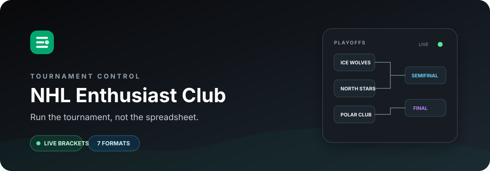

<div align="center">
  

  <br />

  **A focused tournament desk for hockey communities.**

  Create competitions, invite players, record results, and follow every group, bracket, and placement game from one responsive dashboard.

  <br />

  
  
  
  
  
</div>

## What is here

NHL Enthusiast Club turns the admin foundation in this repository into a purpose-built competition manager. The current experience centers on authenticated clubs, live tournament activity, match entry, standings, and bracket progression—not a generic admin demo.

| Competition controls | Club experience |
| --- | --- |
| Playoffs-only and group-to-playoff formats | Username/password authentication |
| Winners, losers, and placement brackets | Personal activity and featured-result feed |
| 2v2 tournaments and playoffs | NHL and international team pools |
| Single/double round-robin tiers | Responsive light and dark themes |
| Goal-difference duels | Profiles, friendships, and tournament membership |
| Server-enforced progression and result locking | Role-aware tournament management |

The interface follows the app's current rink-dark neutral palette (`#09090B`, `#141A21`) with ice-blue, purple, and primary green accents (`#078DEE`, `#7635DC`, `#00A76F`). Light and dark modes, alternate accent presets, and responsive navigation are built in.

## Stack

- **Client:** React 19, TypeScript, Vite 6, React Router 7
- **UI:** Tailwind CSS 4, shadcn/ui primitives, Ant Design, Lucide and Iconify
- **Data and auth:** Supabase with row-level security, migrations, views, triggers, and RPC routines
- **State and requests:** Zustand and TanStack Query
- **Quality:** Biome, TypeScript, Lefthook, and SQL drift/regression checks

## Local setup

### Prerequisites

- Node.js 20
- pnpm 10.8.0 (the version pinned in `package.json`)
- A Supabase project with this repository's migrations applied

### 1. Install

```bash
git clone <your-repository-url>
cd Build-better-controls
pnpm install
```

### 2. Configure the environment

Copy the checked-in defaults, then add the Supabase browser credentials for your project:

```bash
cp .env.example .env.local
```

```dotenv
VITE_SUPABASE_URL=https://your-project.supabase.co
VITE_SUPABASE_ANON_KEY=your-anon-key
```

The existing `VITE_APP_*` values control the public path, API base URL, default route, and client-side routing mode. Only expose Supabase's public/anonymous key to Vite—never a service-role key.

### 3. Prepare Supabase

Apply the SQL files in `supabase/migrations/` to a development project in filename order. Reusable canonical routine definitions live in `supabase/routines/`; see [`docs/supabase-routine-canonical-source.md`](./docs/supabase-routine-canonical-source.md) before changing generated database behavior.

### 4. Run

```bash
pnpm dev
```

Vite serves the app at the URL printed in the terminal (normally `http://localhost:3001`). Create an account from the login card, then open **Tournaments** to create your first competition.

## Useful commands

| Command | Purpose |
| --- | --- |
| `pnpm dev` | Start the Vite development server |
| `pnpm build` | Type-check and create a production build |
| `pnpm preview` | Serve the production build locally |
| `pnpm exec biome check .` | Run repository formatting and lint checks |
| `pnpm check:supabase-routines` | Detect drift between canonical routines and migrations |

Focused TypeScript tests use Node's test runner through `tsx`, for example:

```bash
pnpm exec tsx --test src/lib/db.placement.test.ts
```

## Repository map

```text
src/
├── auth/                 # Supabase session and route protection
├── pages/tournaments/    # Tournament setup, standings, and bracket UI
├── lib/                  # Database access and tournament contracts
├── routes/               # React Router configuration
├── theme/                # Light/dark tokens and color presets
└── ui/                   # Shared interface primitives
supabase/
├── migrations/           # Ordered schema and behavior changes
├── routines/             # Canonical stored-routine definitions
└── scripts/              # Audits and regression fixtures
docs/                     # Database and preset contracts
```

Database behavior and frontend tournament flows are tightly coupled. When changing a preset, bracket rule, or RPC, update the relevant contract documentation and add a focused regression check. More contributor context is available in [`AGENTS.md`](./AGENTS.md).

## Project origin

This project was originally built from [**Slash Admin**](https://github.com/d3george/slash-admin), the React admin dashboard created by d3george. Its layout, theme system, and component foundation made this hockey-focused experience possible; the repository now layers its own Supabase-backed tournament domain and visual identity on top.

## License, attribution, and feedback

The repository remains available under the already-posted [MIT License](./LICENSE). Please retain the copyright and permission notice from that file in copies or substantial portions of the software, including the original Slash Admin attribution.

Feedback is welcome: use this repository's issue tracker for bugs, tournament-format ideas, and usability suggestions. When reporting a bracket or progression issue, include the preset, participant count, current stage, and the steps that produced it.
